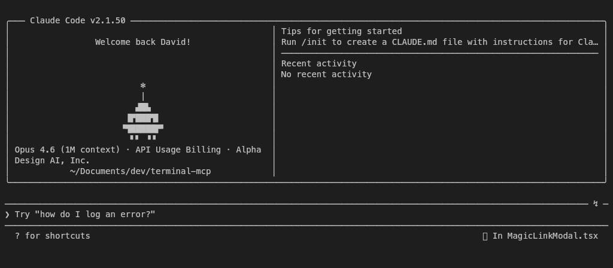
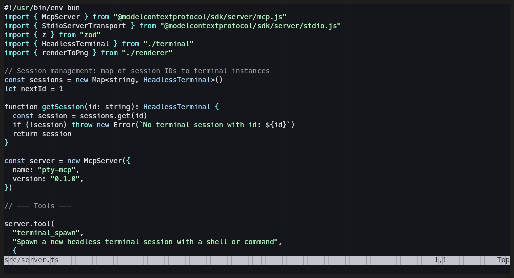

# pty-mcp

An MCP server that provides headless terminal emulation. Spawn interactive terminal sessions, send keystrokes, and capture screenshots — all programmatically via the [Model Context Protocol](https://modelcontextprotocol.io).

Built for AI agents that need to interact with TUI applications, run commands in a real PTY, and visually inspect terminal output.

<p align="center">
  
</p>

<p align="center">
  
</p>

## How it works

```
bun-pty / node-pty (spawn process in a real PTY)
  → @xterm/headless (parse escape sequences into virtual screen buffer)
  → @napi-rs/canvas (render cell grid to PNG)
  → MCP server (expose as tools over stdio)
```

Programs see a real terminal (colors, cursor movement, alternate screen, mouse support), but no physical terminal is attached. The virtual screen buffer can be read as plain text or rendered to a PNG screenshot at any time.

## Tools

| Tool | Description |
|------|-------------|
| `terminal_spawn` | Spawn a new terminal session with a shell or command |
| `terminal_write` | Send input — text, Enter (`\r`), Ctrl+C (`\x03`), Escape (`\e`), etc. |
| `terminal_screenshot` | Capture the screen as PNG image, plain text, or both |
| `terminal_resize` | Change terminal dimensions |
| `terminal_wait` | Wait for output to settle, then return text content |
| `terminal_kill` | Kill a session and clean up |
| `terminal_list` | List all active sessions |

## Install

Works with [Bun](https://bun.sh) (v1.0+) or [Node.js](https://nodejs.org) (v18+).

**Bun:**

```bash
bunx pty-mcp
```

**Node.js:**

```bash
npx pty-mcp
```

Or install globally:

```bash
# Bun
bun install -g pty-mcp

# Node.js
npm install -g pty-mcp
```

## Usage

### MCP client configuration

Add to your MCP client config (e.g. Claude Desktop, Cursor, etc.):

```json
{
  "mcpServers": {
    "terminal": {
      "command": "bunx",
      "args": ["pty-mcp"]
    }
  }
}
```

### Development

```bash
git clone https://github.com/dayvidwang/pty-mcp
cd pty-mcp
bun install   # or: npm install
bun run dev   # or: npm run start:node
```

### Example interaction

An AI agent can use the tools to interact with any terminal application:

```
1. terminal_spawn(shell: "vim", args: ["file.txt"], cols: 120, rows: 40)
2. terminal_wait(sessionId: "term-1", ms: 1000)
3. terminal_screenshot(sessionId: "term-1")          → see vim loaded
4. terminal_write(sessionId: "term-1", data: "ihello world")
5. terminal_write(sessionId: "term-1", data: "\e:wq\r")
6. terminal_screenshot(sessionId: "term-1")          → see the result
7. terminal_kill(sessionId: "term-1")
```

## Stack

| Layer | Package |
|-------|---------|
| PTY | [bun-pty](https://github.com/nicolo-ribaudo/bun-pty) (Bun) / [node-pty](https://github.com/nickolasburr/node-pty) (Node.js) |
| Terminal emulation | [@xterm/headless](https://www.npmjs.com/package/@xterm/headless) |
| PNG rendering | [@napi-rs/canvas](https://github.com/nicolo-ribaudo/napi-rs-canvas) |
| HTML serialization | [@xterm/addon-serialize](https://www.npmjs.com/package/@xterm/addon-serialize) |
| MCP server | [@modelcontextprotocol/sdk](https://github.com/modelcontextprotocol/typescript-sdk) |

## License

MIT
